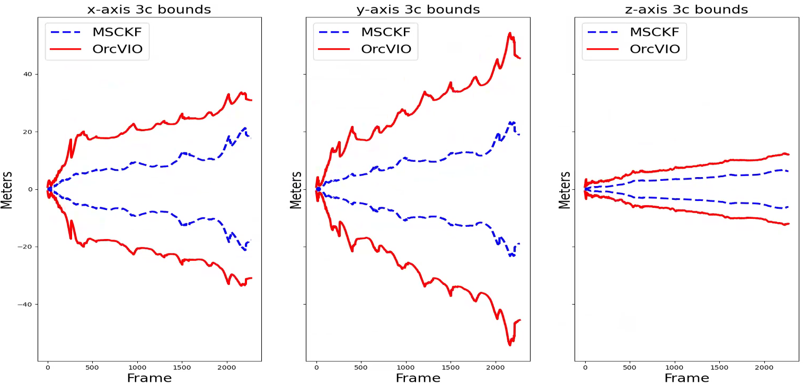

## about 

This repo implements the mono version of [OrcVIO](https://moshan.cf/orcvio_githubpage/), and is developed for analyzing its covariance.

## environment setup 

- platform `ubuntu 18.04` 
- using conda `conda env create --file environment.yml`
- install pip packages 
   * `pip install sophuspy` 

## EuRoC demo 

- setup python path 
```
export PYTHONPATH="${PYTHONPATH}:/home/erl/orcvio/orcvio-covariance-python"
```
- perform tests 
```
python ./tests/test_msckf.py
python ./tests/test_quaternions.py
python ./tests/test_triangulation.py
python ./tests/test_twopoint_ransac.py
```
- run demo on euroc MH02 easy 
```
python ./examples/run_on_euroc.py --euroc_folder /mnt/disk2/euroc/MH_02_easy/mav0 --use_viewer --start_timestamp 1403636896901666560
```
- result 

- covariance analysis 
> From figure below we can see MSCKF is making overconfident estimations whereas OrcVIO does not, due to the closed-form covariance propagation 


## references 

- https://github.com/Edwinem/msckf_tutorial
- https://github.com/uoip/stereo_msckf

